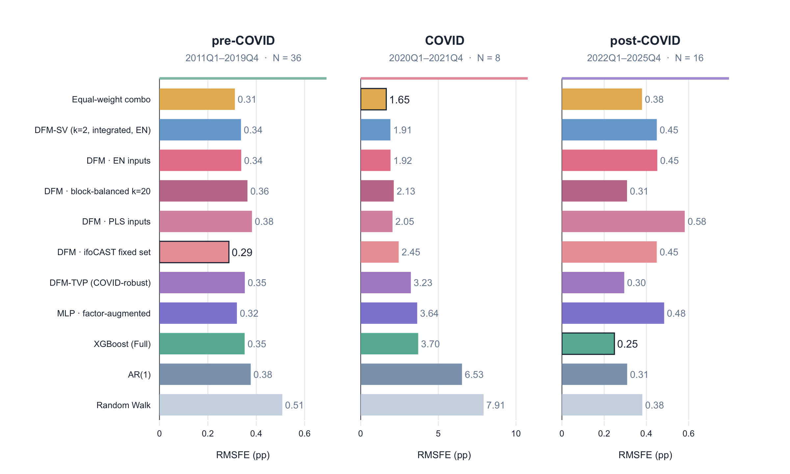
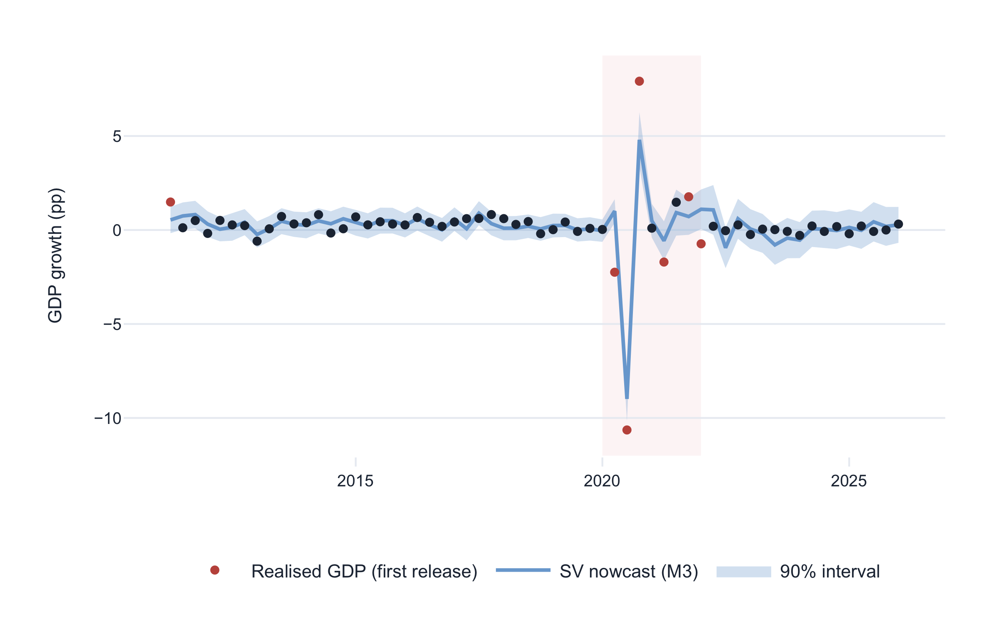

# German GDP nowcasting

[](https://www.python.org/)
[](#tests)
[](docs/DATA.md)

Code accompanying the master's thesis
*[Nowcasting and Indicator Selection in a Data-Rich Environment: An Application to German GDP Growth](#citation)*.

German GDP growth is the reference series for the German economy. The first official estimate appears only after the quarter has ended. This repository reconstructs a pseudo-real-time nowcast from a 585-series monthly panel under one protocol: a first-release target, a publication-lag map, and expanding training windows. Part I asks which series recursive selectors recover, and whether they agree. Part II puts those sets through one mixed-frequency dynamic factor model and asks whether the monthly panel — and later releases of the hard-activity data the selectors prefer — still help after 2022.

## What the results say



*M3 RMSFE by regime, 2011Q1–2025Q4. Rows keep the full-sample ranking. Factor models contain the 2020 collapse and rebound; after 2022 that ordering no longer holds. The figure omits the rolling and intercept-corrected AR(1), which lead the post-COVID window in the thesis (0.207 and 0.245). XGBoost's post-COVID bar is the most favourable of five seeds (0.248–0.618).*

**Part I.** Elastic net, a block-balanced variant, partial least squares and gradient-boosting importance all place 65–100% of selected mass on delayed hard activity data (production, turnover, orders, trade, construction), against 29% of the panel, and under-weight timely series relative to the panel's 70% lag-0 share. They agree only weakly on which series: rank correlations 0.28–0.43; only two series are selected by the elastic net at every origin; mean Jaccard overlap with the frozen ifoCAST set is 0.11. Selection is informative about *what kind* of data matters, not about a unique indicator list.

**Part II.** Over 60 quarters the equal-weight combination of DFM-EN, DFM-block-balanced and DFM-ifoCAST has RMSFE 0.677, against 0.784 for DFM-EN and 2.406 for an expanding AR(1). No test against the AR(1) rejects equal accuracy: the gain is almost entirely the eight pandemic quarters (1.921 against 6.525). After 2022 a rolling AR(1) is most accurate (0.207), and every reported DFM has a higher average RMSFE at M3 than at M1. In the DFM-EN counterfactual, updating the hard-activity block alone almost exactly reproduces that deterioration; updating the non-hard complement leaves RMSFE at its M1 level. Bootstrap intervals for that attribution include zero. The 90% model confidence set retains all eleven headline candidates. Sixteen post-COVID quarters cannot identify a best set or model.



*Integrated DFM-SV nowcasts with 90% intervals, M3 origins. Full-sample coverage is 53 of 60 (88.3%), the average of 97.2% before COVID, 25.0% during it and 100% afterwards. Six of seven misses fall in the eight pandemic quarters.*

The monthly panel earns its keep as crisis insurance, not as a uniform upgrade over a simple autoregression. The practical reading is a parallel nowcast: the equal-weight factor combination as a reference, short-memory autoregressions as challenge forecasts, and SV intervals not taken at face value during a shock.

## Research questions

1. What monthly information do recursive selection methods recover for German GDP, and do distinct methods agree?
2. Once those sets enter a mixed-frequency dynamic factor model, how does the choice of indicators affect nowcasts of current-quarter GDP?
3. After 2022, which specifications remain useful, and do later within-quarter releases of the hard-activity data that selection prefers still improve the nowcast?

## Design

Four recursive selectors are recorded at 180 monthly origins (2011M1–2025M12). The underlying regressions are re-estimated only when a newly completed quarter enters the training window, so the three monthly origins in a quarter share the same set. Publication lags are left to the nowcasting models.

| Selector | Signal | Size |
|---|---|---|
| Elastic net | Non-zero coefficients after CV, *t*-prefilter, COVID down-weighting | 12–60 series (capped at 60) |
| Block-balanced EN | EN coefficients re-ranked with one series per category | 20 |
| PLS + VIP | Top VIP ranks from five supervised components | 30 |
| XGBoost SHAP | Mean absolute SHAP, lagged features summed to the series | weight, not a set |

Part II holds the mixed-frequency DFM fixed (two factors, Mariano–Murasawa aggregation, Kalman smoothing) and varies the input set: recursively updated EN, block-balanced and PLS selections, plus a frozen ifoCAST reference. Around that backbone sit a TVP bridge, an integrated stochastic-volatility layer, XGBoost on the wide panel, a factor-augmented MLP, expanding / rolling / intercept-corrected AR(1) and a random walk, and the equal-weight combination of DFM-EN, DFM-block-balanced and DFM-ifoCAST.

Evaluation is at M3 for 60 quarters (2011Q1–2025Q4), also at M1 and M2 for the DFM variants, in pre-COVID, COVID and post-COVID windows. Scoring uses RMSFE and MAE, HLN-corrected Diebold–Mariano tests, the Hansen–Lunde–Nason 90% model confidence set, Mincer–Zarnowitz regressions, and interval coverage / CRPS for DFM-SV.

## Repository layout

```text
german-gdp-nowcasting/
├── notebooks/                 # Narrative, in reading order (01–07)
├── src/german_gdp_nowcasting/
│   ├── config/                # Portable paths
│   ├── selection/             # Elastic net, PLS, aggregation, comparison
│   ├── models/dfm|xgboost|mlp
│   └── visualization/
├── scripts/pipelines/         # Full reruns (selection, DFM suite, XGB, figures)
├── tests/                     # Synthetic tests; no private data
├── docs/                      # Data access, reproducibility, figures
├── pyproject.toml
└── requirements.txt
```

The Streamlit dashboard and the LaTeX thesis are kept separately. Licensed data and generated outputs are not in this repository.

## Quick start

Validated with Python 3.13.5.

```bash
git clone https://github.com/Nikta-Kiani/german-gdp-nowcasting.git
cd german-gdp-nowcasting

python3.13 -m venv .venv
source .venv/bin/activate
python -m pip install --upgrade pip
python -m pip install -e ".[full]"
```

```bash
jupyter lab notebooks/
```

The notebooks document the analysis. They load saved results when those files exist; they do not re-fit the 60-quarter backtests unless a `FORCE_RERUN` flag is set. Some stored cell outputs predate the 60-series elastic-net cap. The numbers in the thesis tables — and those produced by `scripts/pipelines/dfm/build_unified_evaluation.py` — are the ones to cite.

## Data

The source workbook is an ifo / Macrobond extract and is not distributed. Point the package at a local copy:

```bash
export GERMAN_GDP_NOWCASTING_DATASET_XLSX="/private/path/ifoCAST_DATA.xlsx"
export GERMAN_GDP_NOWCASTING_DATA_DIR="/private/path/data"
export GERMAN_GDP_NOWCASTING_OUTPUTS_DIR="/private/path/outputs"
```

See [docs/DATA.md](docs/DATA.md) for the expected sheets, derived files and optional review workbooks.

## Running the pipeline

After notebooks 01–02 have written the prepared panel:

```bash
python scripts/pipelines/orchestrators/01_selection.py
python scripts/pipelines/orchestrators/02_dfm.py
python scripts/pipelines/orchestrators/03_dfm_suite.py
python scripts/pipelines/orchestrators/05_xgb.py
python -m german_gdp_nowcasting.models.mlp.mlp_utils
python scripts/pipelines/orchestrators/09_finalize.py
```

The post-COVID DFM-EN release-block counterfactual is a separate experiment:

```bash
python scripts/pipelines/dfm/run_release_block_counterfactual.py
```

Full reruns are expensive and write only to the ignored `outputs/` directory. See [docs/REPRODUCIBILITY.md](docs/REPRODUCIBILITY.md).

## Tests

The suite uses synthetic panels and does not read or overwrite thesis data:

```bash
python -m unittest discover -s tests -t .
```

Twenty-four tests cover imports, path configuration, publication lags, the release-block freeze, quarterly aggregation, selection smoothing, RMSFE / Diebold–Mariano helpers, the model confidence set, and no-look-ahead feature construction.

## Limits of the public code

- Exact thesis estimates require the licensed workbook.
- The predictor panel is a static historical extract, not a vintage-by-vintage database, so indicator revisions are not simulated.
- The evaluation has 60 quarters, of which 16 are post-COVID. The 90% MCS retains every headline model; that is a failure to eliminate, not proof of equal accuracy.
- Expanding-window DFM fits and the SV sampler need substantial compute.

## Citation

Nikta Kiani, *Nowcasting and Indicator Selection in a Data-Rich Environment: An Application to German GDP Growth*, Master's thesis, Ludwig-Maximilians-Universität München, September 2026.
